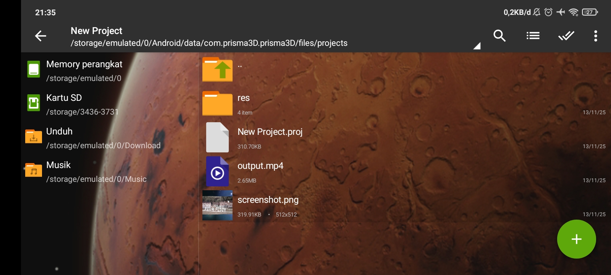

# Prisma 3D Archive

Repositori ini adalah arsip pribadi saya yang berisi proyek-proyek 3D yang dibuat menggunakan aplikasi Android **[Prisma3D](https://play.google.com/store/apps/details?id=com.prisma3D.prisma3D)** pada tahun 2021-2023.

## Screenshots

screenshots dari proyek-proyek di aplikasi.

<div style="display: flex; flex-wrap: wrap; gap: 10px; justify-content: center; align-items: center;" align="center">
  
  
  
</div>

---
## Cara Pakai

### 1. Unduh Proyek
Unduh semua proyek dalam repositori ini sebagai satu file `.zip` dengan mengklik tautan ini:

**[Download Repositori (main.zip)](https://github.com/Ridhsuki/prisma-3d-archive/archive/refs/heads/main.zip)**

### 2. Siapkan File Manager
diperlukan file manager yang dapat mengakses folder `Android/data`. Aplikasi yang recomended adalah **[ZArchiver](https://play.google.com/store/apps/details?id=ru.zdevs.zarchiver)**.

### 3. Ekstrak dan Pindahkan File
Setelah file `main.zip` terunduh:

1.  Buka **ZArchiver**.
2.  Buka folder `Download` temukan file `prisma-3d-archive-main.zip`.
3.  Ketuk file tersebut dan pilih **"Ekstrak di sini"** atau **"Ekstrak..."**.
4.  Setelah diekstrak,akan ada folder `prisma-3d-archive-main`. Buka folder tersebut.
5.  Di dalamnya, akan ada semua folder proyek (seperti `pesawat`, `project`, dll.).
6.  Pilih (Select) **semua folder proyek** tersebut dan pilih **"Salin"** (Copy).
7.  Navigasi ke direktori (folder) tujuan Prisma3D di penyimpanan internal:

    ```bash
    Android/data/com.prisma3D.prisma3D/files/projects/
    ```

8.  Tempel (Paste) semua folder yang sudah di salin ke dalam folder `projects` tersebut.

Struktur folder akan terlihat seperti ini:

```
  └───com.prisma3D.prisma3D
    ├───cache
    └───files
        ├───clips
        ├───fonts
        ├───il2cpp
        │   ├───Metadata
        │   └───Resources
        ├───presets
        ├───projects
        │   └───# Taruh folder proyek 3D di sini
        └───Unity
```
#### Bantuan Visual (Instalasi)
Gunakan gambar ini sebagai panduan untuk proses ekstrak dan pemindahan file di ZArchiver.

<div style="display: flex; flex-wrap: wrap; gap: 10px; justify-content: center; align-items: center;" align="center">
  
  
</div>

### 4. Selesai
Buka kembali aplikasi **Prisma3D**. Semua proyek yang di ekstrak tadi akan muncul.

---

## Contoh implementasi proyek pada editing Video

* https://www.instagram.com/reel/Cf3sdloL9IU/?utm_source=ig_web_copy_link&igsh=MzRlODBiNWFlZA==
* https://youtu.be/33N0AzMCo28?si=-sYFlChUUeNsbsV4
* https://youtu.be/IkcSM1_eD-E?si=HaUn2DRe1kf3M2gC
* https://youtu.be/TOpI7a0nWIY?si=YXmpyM6yD4jlVzgJ
* https://www.youtube.com/watch?v=JUjmETxshsQ
* https://youtube.com/shorts/VI6w46NyC2Q?si=Y8BxNg8NXJJ3D4lV
* https://www.instagram.com/reel/C4-Pj8ZBQCt/?utm_source=ig_web_copy_link&igsh=MzRlODBiNWFlZA==

view more on
**[https://www.youtube.com/@RIDHO_AG/videos](https://www.youtube.com/@RIDHO_AG/videos)**

