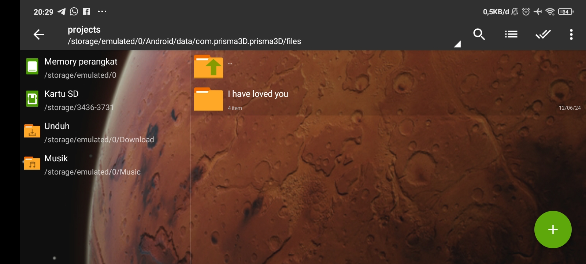
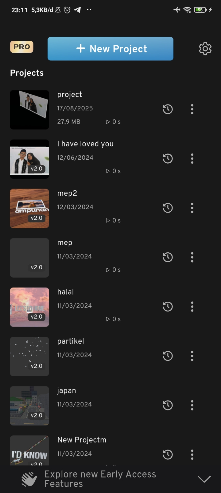
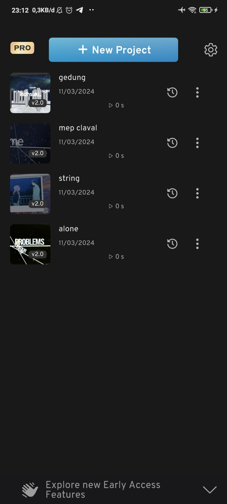

# Prisma 3D Archive
Repository ini saya gunakan untuk menyimpan proyek2 bekas editing 3D saya yang menggunakan Aplikasi Android Prisma3D pada tahun 2021-2023

## Cara Pakai

- Download https://github.com/Ridhsuki/prisma-3d-archive/archive/refs/heads/main.zip
- Masuk di Android dengan menggunakan aplikasi ZArchiver
  
  ```
  Android/data/com.prisma3D.prisma3D/files/projects/ here
  ```
  
- Ekstrak semua folder proyek nya di dalam folder projects
  ```
  └───com.prisma3D.prisma3D
    ├───cache
    └───files
        ├───clips
        ├───fonts
        ├───il2cpp
        │   ├───Metadata
        │   └───Resources
        ├───presets
        ├───projects
        │   └───# Taruh folder proyek 3D di sini
        └───Unity
  ```

  <br>
  <div style="display: flex; flex-wrap: wrap; gap: 10px; justify-content: center; align-items: center;" align="center">
    
  </div>

  
## screenshoots
  <br>
  <div style="display: flex; flex-wrap: wrap; gap: 10px; justify-content: center; align-items: center;" align="center">
    
    
    
  </div>

## Implementasi proyek pada editing Video
https://www.youtube.com/@RIDHO_AG/videos
